# CLIENT-SITE-FORTIGATE

> **Autor:** Randy Nin **| Laboratorio de Redes | GNS3**

Implementación de una VPN Client-to-Site dial-up con IPSec IKEv2 y autenticación EAP en FortiGate, configurada íntegramente desde la interfaz gráfica, con FortiClient como cliente en Windows 11. La negociación IKEv2 se extiende a 14 mensajes (frente a los 4 habituales) por el intercambio EAP embebido, y el acceso se limita mediante split tunneling a la LAN de SITE-B.

---

## Contenido del repositorio

```
CLIENT-SITE-FORTIGATE/
├── images/
│   ├── topology.png
│   ├── before-vpn-ping.png
│   ├── after-vpn-ping.png
│   ├── tracert.png
│   ├── wireshark-ikev2-eap.png
│   ├── wireshark-esp.png
│   ├── fortigate-interfaces.png
│   ├── fortigate-static-route.png
│   ├── fortigate-addresses.png
│   ├── fortigate-user-group.png
│   ├── fortigate-phase1-network.png
│   ├── fortigate-phase1-auth-proposal.png
│   ├── fortigate-phase2.png
│   ├── fortigate-firewall-policy.png
│   ├── fortigate-ipsec-monitor.png
│   ├── forticlient-connection.png
│   ├── forticlient-phase1-2.png
│   ├── forticlient-connected.png
│   └── virtual-adapter-ipconfig.png
├── IPSec-IKEv2
├── SITE-B.conf
├── RandyNin_2025-0660_Informe_P1.md
└── README.md
```

---

## Documentación técnica

**[Documentación Tecnica Profesional VPN - Client-to-Site - FortiGate - IPSec - IKEv2 (Randy Nin -- 2025-0660).pdf](Documentación%20Tecnica%20Profesional%20VPN%20-%20Client-to-Site%20-%20%20FortiGate%20-%20IPSec%20-%20IKEv2%20(Randy%20Nin%20--%202025-0660).pdf)**

---

## Topología

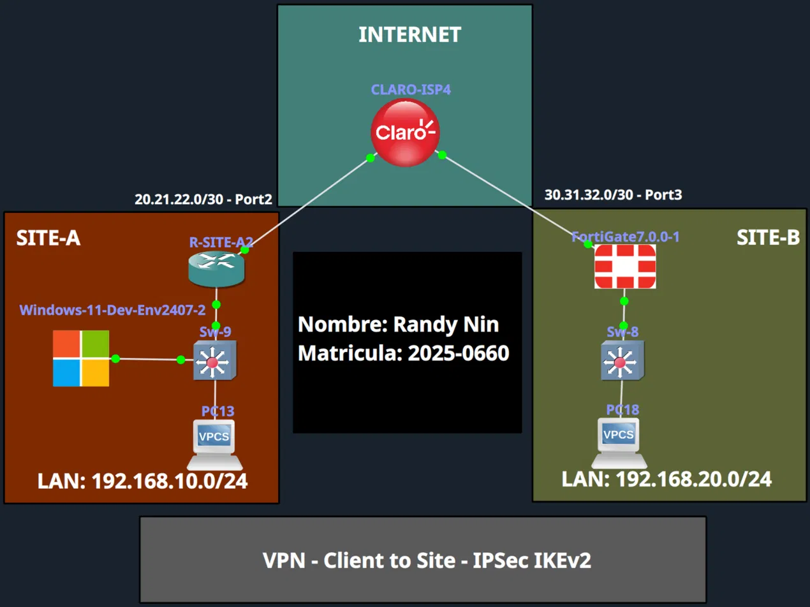

|Dispositivo|Rol|IP|
|:--|:--|:--|
|FortiGate (SITE-B)|Servidor VPN dial-up|30.31.32.1 (WAN) / 192.168.20.1 (LAN)|
|R-SITE-A|Gateway de salida del cliente|20.21.22.1 / 192.168.10.1|
|Windows-11 + FortiClient|Cliente VPN|192.168.10.10 (física) / 192.168.99.1 (túnel)|

---

## Lo distinto de este lab: EAP dentro de IKEv2

|Comparación|Detalle|
|:--|:--|
|Mensajes IKEv2 estándar (labs anteriores)|4 (2 IKE_SA_INIT + 2 IKE_AUTH)|
|**Mensajes en este lab**|**14** (4 IKE_SA_INIT con renegociación DH + 10 IKE_AUTH en 5 rondas EAP)|
|Causa|`set eap enable` + `set authusrgrp "VPN-USERS"` en la Fase 1|

---

## Configuración FortiGate (GUI)

**Interfaces y ruta estática (solo el default, sin rutas manuales para el pool VPN):**

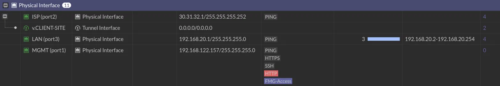 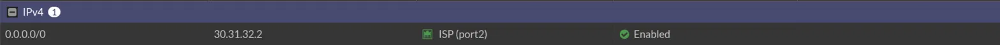

**Objetos de dirección (LAN y VPN-RANGE como IP Range):**

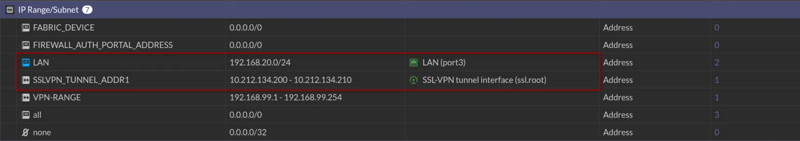

**Usuario y grupo (autenticación EAP):**

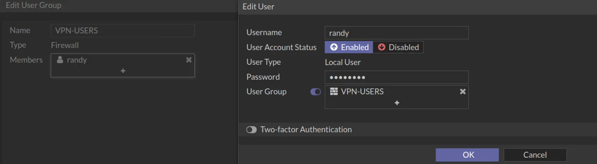

**Fase 1: Dialup User, Mode Config, Split Tunnel:**

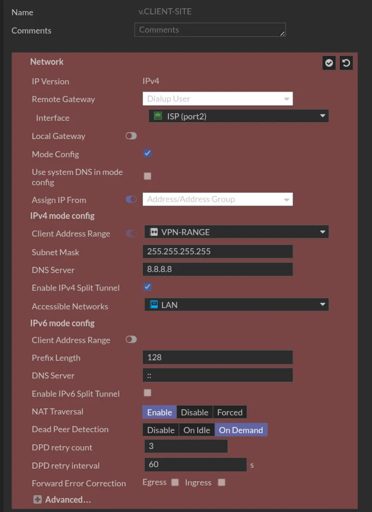 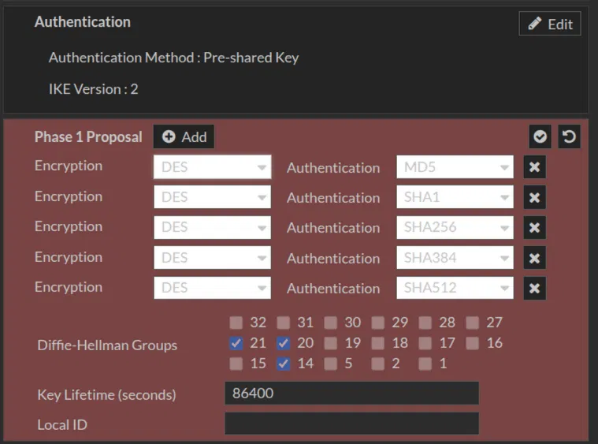

**Fase 2: selectores universales (0.0.0.0/0):**

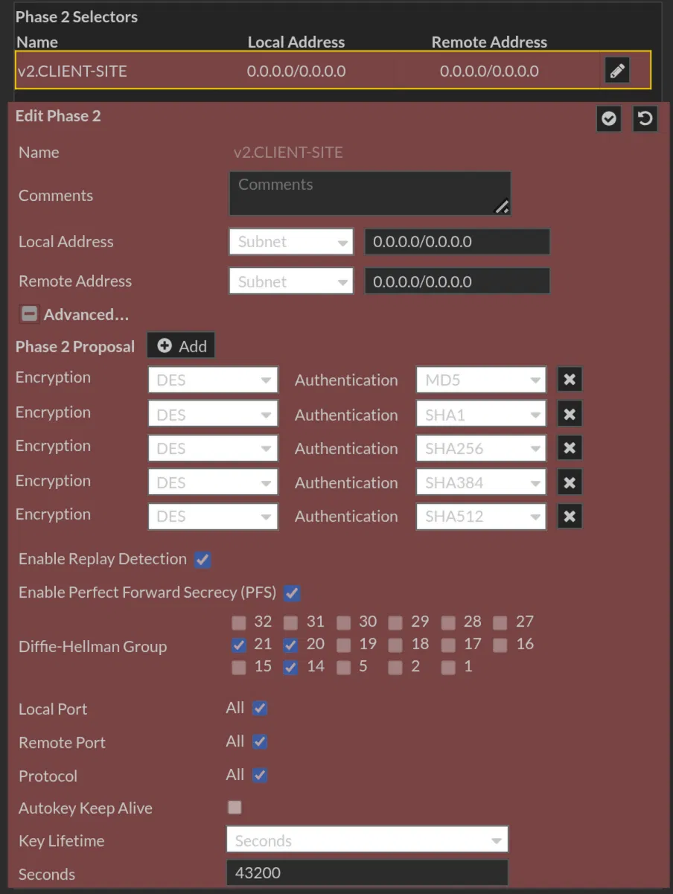

**Política de firewall (solo una regla relacionada con la VPN):**

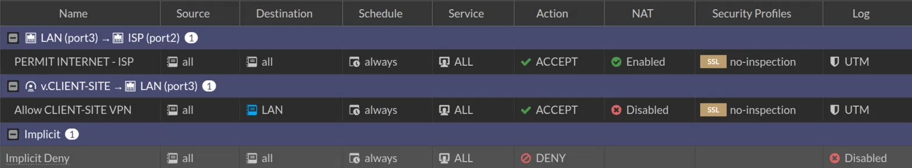

---

## Configuración del cliente (FortiClient VPN)

|Campo|Valor|
|:--|:--|
|Remote Gateway|30.31.32.1|
|Authentication Method|Pre-shared key|
|Authentication (EAP)|Prompt on login|
|IKE Version|2|
|Address Assignment|Mode Config|

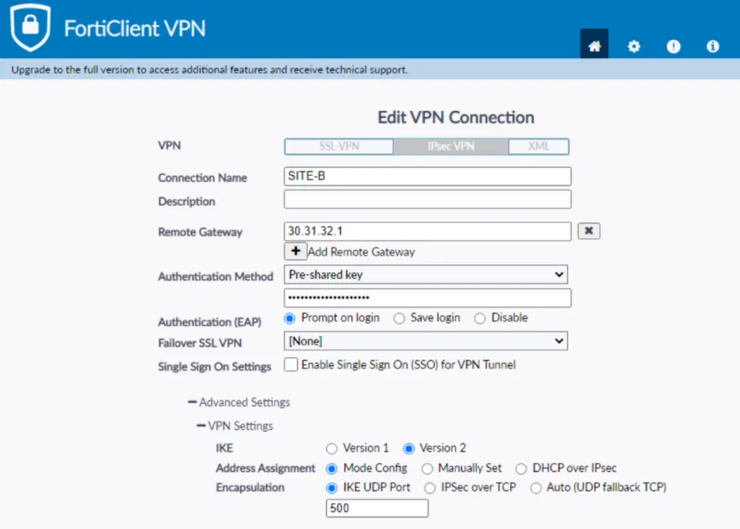 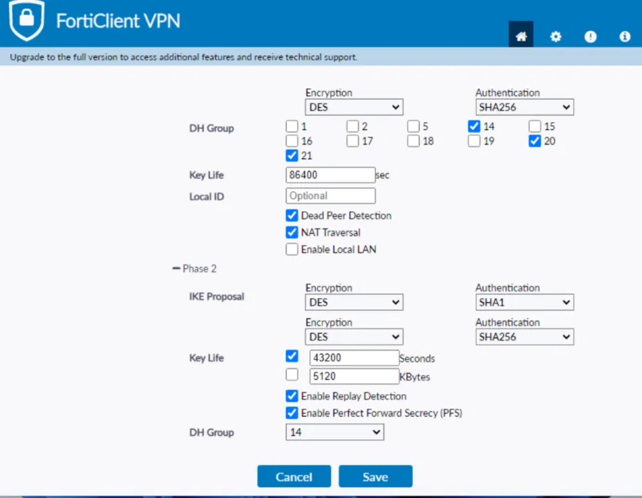

---

## Configuración CLI equivalente

Archivos completos: [`IPSec-IKEv2`](./IPSec-IKEv2) (ISP + R-SITE-A) y [`SITE-B.conf`](./SITE-B.conf) (FortiGate). Bloque clave:

```
config vpn ipsec phase1-interface
    edit "v.CLIENT-SITE"
        set type dynamic
        set ike-version 2
        set mode-cfg enable
        set eap enable
        set eap-identity send-request
        set authusrgrp "VPN-USERS"
        set assign-ip-from name
        set ipv4-split-include "LAN"
        set ipv4-name "VPN-RANGE"
    next
end
```

---

## Antes de la VPN: sin conectividad

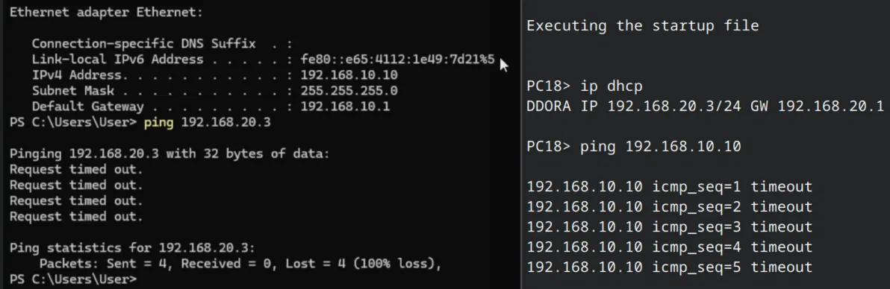

---

## Conectar con FortiClient

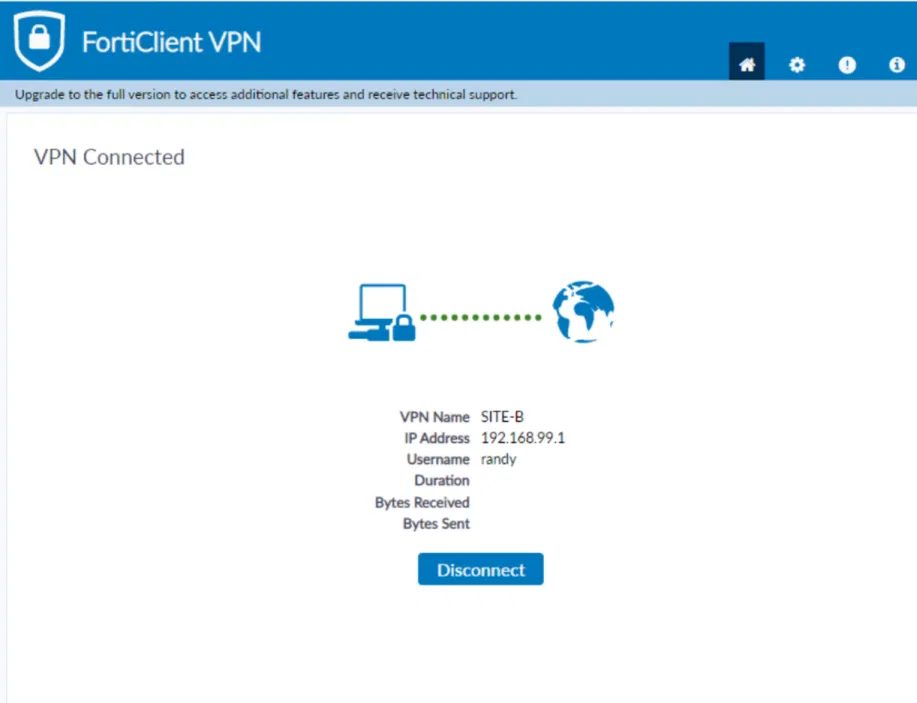

El adaptador virtual recibe una IP `/32` sin gateway por defecto, confirmando el split tunnel:

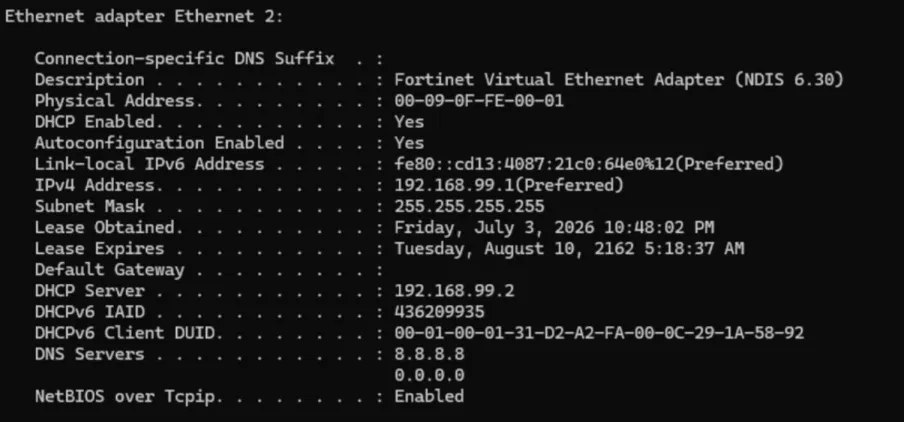

---

## Negociación IKEv2 con EAP: 14 mensajes

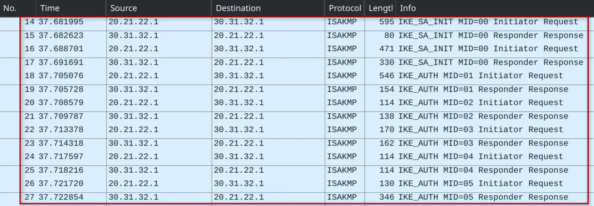

---

## Tráfico ESP cifrado

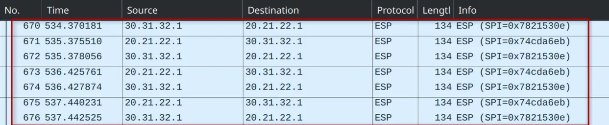

---

## Conectividad establecida

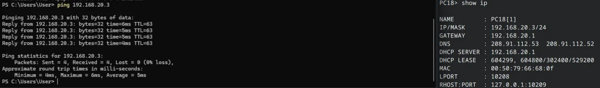

**Traceroute sin salto silencioso (a diferencia del lab Site-to-Site), por selectores de Fase 2 universales:**

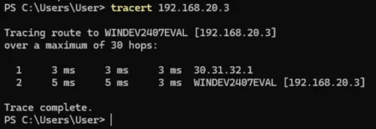

---

## Comparativa rápida: los 3 Client-to-Site y Site-to-Site FortiGate

|Método|Plataforma|IKE|Msgs|Autenticación de usuario|
|:--|:--|:-:|:-:|:--|
|Site-to-Site FortiGate|FortiGate|v1|9|No|
|Client-to-Site L2TP|Cisco IOS|v1|9|PPP MS-CHAPv2|
|**Client-to-Site FortiGate**|**FortiGate**|**v2**|**14**|**EAP nativo en IKEv2**|

---

## Video demostrativo

**LINK:** [https://youtu.be/Ikup3pZeuHA](https://youtu.be/Ikup3pZeuHA)

---

## Disclaimer

Este laboratorio fue desarrollado con fines exclusivamente académicos y educativos en un entorno controlado en GNS3.

---

_Randy Nin / Matrícula 2025-0660_

---
